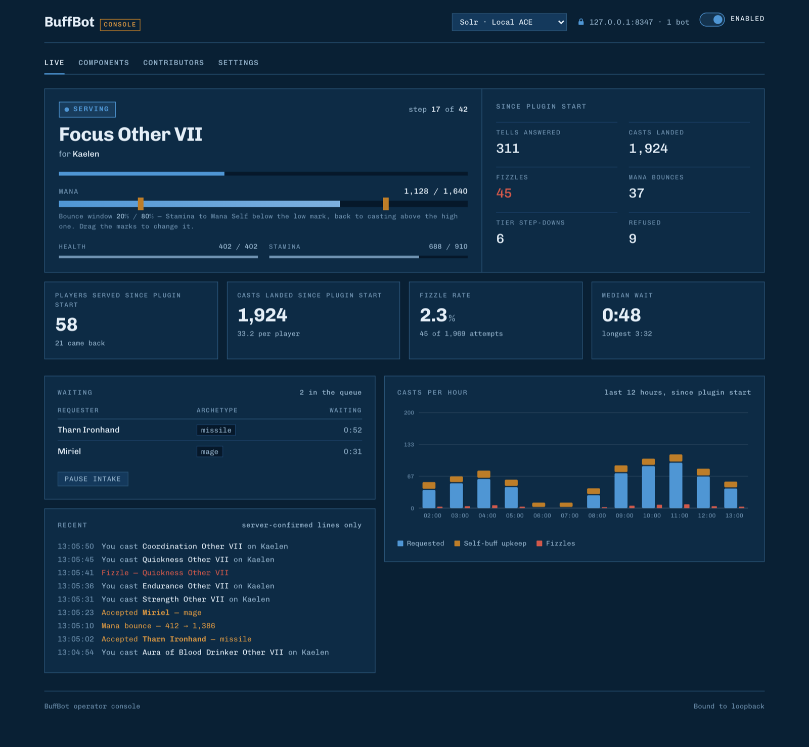
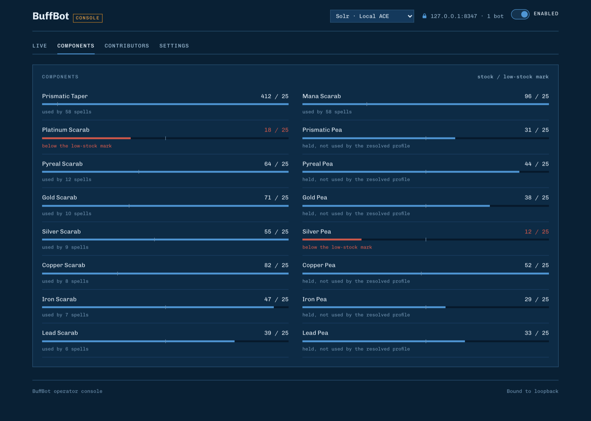
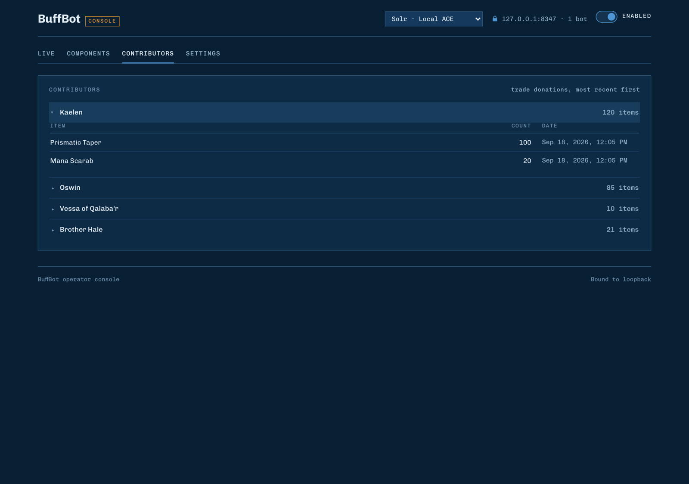
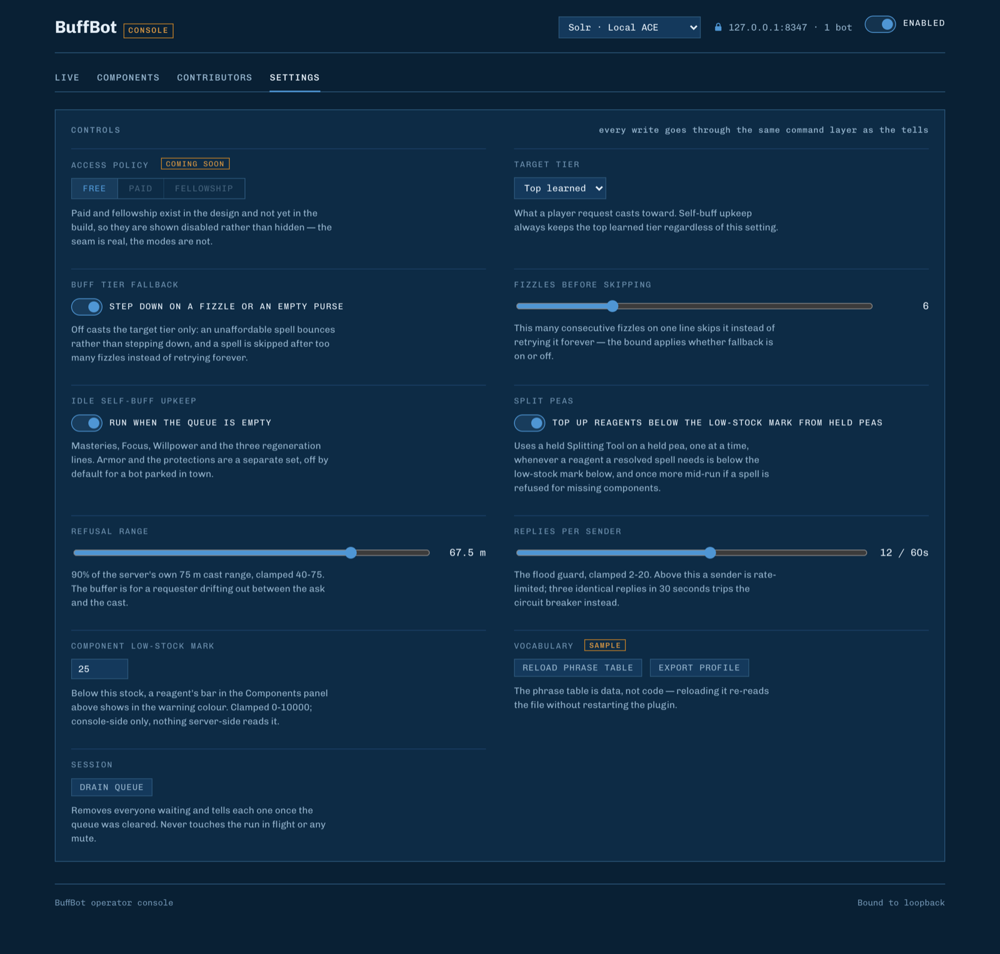

<p align="center">
  
</p>

<h1 align="center">BuffBot</h1>

<p align="center">
  <b>A buff bot plugin for <a href="https://github.com/eriknihlen/OpenAC">OpenAC</a>, the open-source Asheron's Call client.</b><br>
  Players send it a tell, and it casts the right buffs for how they play.
</p>

<p align="center">
  
  
  
  
  
</p>

<p align="center">
  
</p>

---

## Contents

- [What it does](#what-it-does)
- [Getting buffed (for players)](#getting-buffed-for-players)
- [Portals](#portals)
- [Running a bot](#running-a-bot)
- [The web console](#the-web-console)
- [Owner commands](#owner-commands)
- [Donations](#donations)
- [Where things are stored](#where-things-are-stored)
- [Maturity](#maturity)
- [License](#license)

## What it does

Park a caster in town, turn BuffBot on, and it becomes a buffer that looks after itself.

| | |
|---|---|
| **Buffs by playstyle** | A player tells the bot how they fight (`heavy`, `bow`, `mage`, `void` and so on) and it works out the full spell chain for that style: attributes, the skills that style uses, protections, and the XP chain. |
| **One at a time, fairly** | One player is served at a time. Everyone else waits in a queue and can ask where they stand or drop out. |
| **Summons portals on request** | Tie the bot to a portal and players can ask where it goes and have it summoned. A portal request cuts into a buff chain at a spell boundary, so nobody waits for a whole chain and nothing is recast. |
| **Casts in survival order** | Trade and utility buffs go on first and protections and regeneration last, so the buffs a player can most afford to lose are the first to expire. |
| **Keeps itself going** | It rebuffs itself when idle and after a death, bounces its own mana with Stamina to Mana Self, steps down a tier when a cast is refused, and splits peas into scarabs when a reagent runs low. |
| **Hard to abuse** | Per-player rate limiting, an automatic mute for anyone flooding it, and a range check so it never starts a chain on someone who wandered off. |
| **Safe donations** | Players can donate components through the secure trade window. The bot only accepts what it actually uses, and it never gives items away on its own. |
| **A console you can watch** | A web page on your own machine shows what the bot is doing right now, its stock, who has donated, and every setting. |
| **Graphical or headless** | Run it on a normal client with a window, or headless with no window at all. |

## Getting buffed (for players)

Send the bot a tell with a keyword. That's it.

```
/tell Solr, heavy
```

It replies with where you are in line, tells you when it starts, and casts until you are buffed. Stay within range (about 67 meters by default) until it finishes.

### Buff keywords

| Say | You get | Also accepts |
|---|---|---|
| `heavy` | Full melee set with Heavy Weapon, Dual Wield and Shield Mastery | |
| `light` | Full melee set with Light Weapon, Dual Wield and Shield Mastery | |
| `finesse` | Full melee set with Finesse Weapon, Dual Wield and Shield Mastery | `fw`, `finesseweapons` |
| `2h` | Full melee set with Two Handed Combat Mastery | `twohand`, `twohanded`, `twohandedweapons` |
| `dual` | Full melee set with Dual Wield Mastery | `dualwield` |
| `missile` | Full set with Missile Weapon Mastery and the weapon auras | `bow`, `xbow`, `crossbow`, `thrown` |
| `mage` | Full set with War Magic Mastery and Aura of Spirit Drinker | `war` |
| `void` | Full set with Void Magic, Sneak Attack Mastery and Aura of Spirit Drinker | |
| `prots` | The seven protections and Aura of Defender | |
| `buffs` | A quick 14-spell set: six attributes, Armor and the seven protections | `buff`, `buff me` |
| `tink` | Attributes and the four tinkering expertise lines, plus the XP chain. No protections | |
| `trades` | Attributes and trade skills (Fletching, Alchemy, Cooking, Lockpick and more), plus the XP chain. No protections | |

"Full set" means the six attributes, the magic school masteries, the regeneration lines, Impregnability, Invulnerability, Magic Resistance, Armor, Aura of Hermetic Link, Leadership and Fealty, and the protections. Melee styles also get Heart Seeker, Blood Drinker and Swift Killer auras, and if you have a shield in hand, the bane spells go on it.

### While you wait

| Say | What happens |
|---|---|
| `position` or `line` | Tells you how many people are ahead of you. |
| `cancel` or `remove` | Takes you out of the queue. If it is already casting on you, it stops after the current spell. |
| *a different keyword* | Swaps what you asked for without losing your place in line. |

### Anytime

| Say | What happens |
|---|---|
| `help` or `?` | Lists everything the bot understands. |
| `status` | Shows how busy the bot is. |
| `contribute` | Tells you which components the bot is low on and how to donate. |

## Portals

If the bot's owner has tied it to a portal, players can ask for one.

| Say | What happens |
|---|---|
| `where` or `whereto` | Names where the bot's portals go, in the owner's own words. |
| `primary` | Summons the primary portal. |
| `secondary` | Summons the secondary portal. |

The bot turns to face the direction its owner set, summons, announces the portal in local chat, and turns back. If it is buffing someone when the request lands, it summons between two spells and then carries on with the chain — nothing already cast is cast again.

A bot with no tie set says so rather than leaving you waiting.

## Running a bot

**You need:** OpenAC 0.1.17 or newer, and a character that knows the buffs you want to hand out, carrying Prismatic Tapers, Mana Scarabs and the scarabs for the tiers it casts.

1. **Install.** Open the OpenAC launcher, find **BuffBot** in the plugins list, and press **Install**. The launcher shows you what the plugin asks permission to do (read tells, run the local web console, save its settings, open your browser).
2. **Log in** with your buffer character. BuffBot does nothing until you turn it on for that character.
3. **Turn it on.** Type `/buffbot on` in your chat box, or press the enable toggle in the BuffBot panel. The choice is remembered for that character across logins.
4. **Open the console.** Press **Open web console** in the BuffBot panel. Your browser opens straight onto the console with access already granted.

To stop taking requests, type `/buffbot off`. Anyone still waiting in line gets a tell saying the queue was cleared.

### Running headless

In the launcher, pick the character, choose **Headless**, and start it. The headless host loads the same installed plugins, so BuffBot runs exactly as it does on a graphical client, just without a window.

With no panel to click, get the console link from the bot's log. Look for the line that starts with:

```
BuffBot web console: http://127.0.0.1:8347/?token=...
```

Open that full address in a browser on the same machine. A headless bot also can't read spell component names, so the Components tab tells you so instead of showing stock.

### Running more than one bot

Every BuffBot on the same machine shares one console. The first bot to start serves the page, and the others join it automatically. Pick which bot you are looking at from the drop-down in the top right. If the bot serving the page logs out, another takes over.

## The web console

The console lives at `http://127.0.0.1:8347`. It only listens on your own machine and every request needs the access key from your link, so nobody else on your network can reach it.

The access key can change when the console restarts. If the page says it needs its access link, press **Open web console** in game again, or copy the new link from the headless log.

### Live

What the bot is doing right now: the spell it is casting and for whom, its progress through the chain, mana, health and stamina, the waiting queue, recent casts, and a chart of casts per hour.

Drag the two orange marks on the mana bar to set the **mana bounce window**. Below the low mark, the bot casts Stamina to Mana Self; above the high mark, it goes back to buffing.

**Pause intake** stops the bot from accepting new requests without dropping anyone already waiting. Players who ask get a polite "try again shortly". Help, status, position and cancel keep working.

### Components



Every taper, scarab and pea the bot holds, against your low-stock mark. Anything below the mark turns red, so you can see what to restock at a glance. Each scarab shows how many of the bot's spells use it.

### Contributors



Everyone who has donated through the trade window, most recent first. Click a name to see what they gave and when. The list survives restarts.

### Settings



Changes take effect on the bot's next run, and are saved per character.

| Setting | Default | What it does |
|---|---|---|
| **Target tier** | Top learned | The spell level player requests are cast at. The bot's own buffs always use its top learned tier. |
| **Buff tier fallback** | On | If a spell fizzles repeatedly or the bot can't afford it, step down a tier instead of skipping it. |
| **Fizzles before skipping** | 6 | How many fizzles in a row on one spell before the bot gives up on it and moves on (1 to 20). |
| **Idle self-buff upkeep** | On | Rebuff itself (masteries, Focus, Willpower, regeneration) whenever the queue is empty. |
| **Split peas** | On | When a reagent drops below the low-stock mark, use a Splitting Tool on a matching pea to make more. |
| **Refusal range** | 67.5 m | How close a player must be to be served (40 to 75 m). Set a little under the server's 75 m so a player who drifts doesn't break the chain. |
| **Replies per sender** | 12 per minute | The flood guard (2 to 20). Beyond this, a player is rate limited. Sending the same thing over and over gets them muted, starting at 1 minute and doubling on each repeat offense up to a 4-minute cap. |
| **Component low-stock mark** | 25 | The stock level that turns a component red on the Components tab. |
| **Primary portal** | Not set | Where the bot's primary portal goes, written in your own words (up to 160 characters) — players hear this text verbatim, so "Aerlinthe — dangerous drop" works. Leave it empty to offer no portal. |
| **Primary portal side** | Front | Which side of the bot the portal appears on: front, right, behind or left. |
| **Secondary portal** | Not set | The same, for a second tie. |
| **Secondary portal side** | Front | The same, for the second tie. |
| **Drain queue** | | Removes everyone waiting and sends each of them a tell. It never interrupts the player being buffed. |

The **Enabled** switch in the top right is the same as `/buffbot on` and `/buffbot off`.

> Access policy (Paid and Fellowship) and the Vocabulary buttons are shown for what's coming. Only **Free** access works in this release, and the Vocabulary buttons do nothing yet.

## Owner commands

These only work when you type them into your own chat box. A tell from another player can never run them.

| Command | What it does |
|---|---|
| `/buffbot on` | Turn BuffBot on for this character. |
| `/buffbot off` | Turn it off. Anyone waiting is told the queue was cleared. |
| `/buffbot status` | Version, whether it's on, and how many tells it has answered. |
| `/buffbot inspect` | Whether it's on, how many are waiting, who is muted, and tells answered. Useful for telling a stuck bot from a busy one. |
| `/buffbot logout` | Log the character out. |

<details>
<summary><b>Diagnostic commands</b></summary>

<br>

These are for troubleshooting. Most write their full output to the client log and post a one-line summary in chat. Item ids can be written in hex (`0x5000A1B2`) or decimal.

| Command | What it does |
|---|---|
| `/buffbot items <player> [cast <spell>]` | List what a nearby player is wielding. |
| `/buffbot inv list [filter]` | List the bot's own inventory, optionally filtered by name. |
| `/buffbot inv use <itemId>` | Use an item. |
| `/buffbot inv apply <toolId> <targetId>` | Use one item on another, such as a Splitting Tool on a pea. |
| `/buffbot inv split <itemId> <containerId> <amount>` | Split a stack into a container. |
| `/buffbot inv merge <fromId> <toId> [amount]` | Merge two stacks. |
| `/buffbot inv drop <itemId> [amount]` | Drop an item. |
| `/buffbot inv give <itemId> <name or id> [amount]` | Hand an item to someone. If a name matches more than one thing nearby, it refuses and asks for the id. |
| `/buffbot chatdump [n]` | Write the last *n* chat messages to the log. |

</details>

## Donations

Players who want to help keep the bot stocked can send it `contribute`. The bot replies with what it's short of and invites them to open a trade.

- Donations only come through the **secure trade window**. Items handed over directly are refused by the server.
- The bot accepts a trade only when everything offered is something it uses. Otherwise it resets the trade and explains why.
- The bot never puts its own items into a trade, never hands anything back, and never drops anything.
- While a trade is open, the bot finishes the player it's buffing but won't start the next one until the trade closes.
- Every accepted donation is recorded on the Contributors tab.

## Where things are stored

Settings and the contributors list live with the rest of your OpenAC install, in the plugin's own folder:

```
<your OpenAC install folder>/plugins/solrlabs.buffbot/files/
```

Installing, updating or removing the plugin never touches that `files/` folder. Where the install folder itself sits depends on your platform, and the launcher's Settings screen shows you the exact path:

| OS | Default install folder |
|---|---|
| Windows | `%LOCALAPPDATA%\OpenAC` |
| macOS | `~/Library/Application Support/OpenAC` |
| Linux | `$XDG_DATA_HOME/openac`, or `~/.local/share/openac` |

**Upgrading from an OpenAC before 0.1.17?** That release reorganised where the client keeps everything, and it does not carry plugin data across. BuffBot brings its own over the first time it starts: anything you had is copied into the new location, anything you have already re-made is left exactly as it is, and the old files are read but never changed or deleted.

The console's access key is kept separately, in a `solrlabs.buffbot` folder in your user app-data directory (`%APPDATA%\solrlabs.buffbot` on Windows, `~/.config/solrlabs.buffbot` on macOS and Linux). BuffBot falls back to that folder for everything else only if the client cannot offer it storage at all.

## Maturity

This is the first stable release. Everything above is covered by tests and has been run against a live server by two characters at once — a bot taking real requests while someone else talked over it — which is the only way a buff bot can actually be judged.

It has still only been exercised on one server, by a handful of characters. If you hit a rough edge, please [open an issue](../../issues).

See [CHANGELOG.md](CHANGELOG.md) for what changed, and [CONTRIBUTING.md](CONTRIBUTING.md) before opening a pull request.

## License

BuffBot is released under the [MIT License](LICENSE) — free to use, change and redistribute,
including commercially, as long as the copyright notice and the licence text travel with it.
It comes with no warranty.

Copyright (c) 2026 SolrLabs LLC.

<sub>Screenshots show sample data.</sub>
